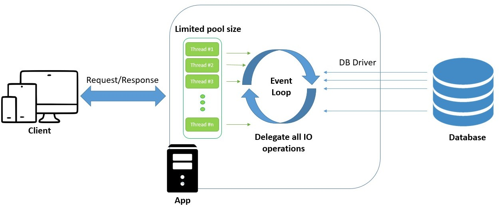

# 🗃️ TelegramDB
WebFlux application for [TelegramBot](https://github.com/PavelBocharov/TelegramBot)'s data.

## 🟢 Build image
1) Compile jar - `mvn clean install`
2) Build docker image - `docker build -t marolok/telegram_db:1.0.0 .`
3) Push docker image - `docker push marolok/telegram_db:1.0.0`
## ⚙️ Config
### Config ENV
1) `BOT_PROFILE` - start profile application.
1) `SPRING_CLOUD_CONFIG_SERVER` - String Cloud Config URL (example, `configserver:http://tbotconf:8888`). 
### Config GIT
* All config in - [TelegramConf](https://github.com/PavelBocharov/TelegramConf)

## 🚢 Docker image
Last - [marolok/telegram_conf:1.2.0](https://hub.docker.com/repository/docker/marolok/telegram_conf/general)